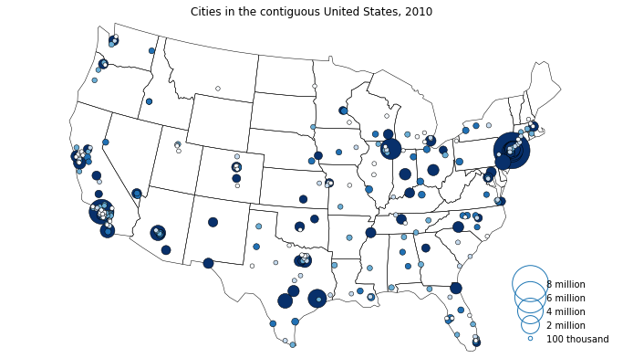

tutorials  

# Basemap
## overview
show how to use <code>basemap</code> in <code>mpl_toolkits.basemap</code>  
see details in https://matplotlib.org/basemap/index.html .  
All comments in Japanese.  
IN PROGRESS

# geoplot
## overview
show how to use <code>geoplot</code>
source on https://nbviewer.jupyter.org/github/ResidentMario/geoplot/blob/master/notebooks/tutorials/Quickstart.ipynb .

confirmed with libraries with below:

Anaconda: 2019.03  
Python: 3.7.3  
geopandas: 0.4.1  
geoplot: 0.2.4  
matplotlib: 3.0.3  

## sample

